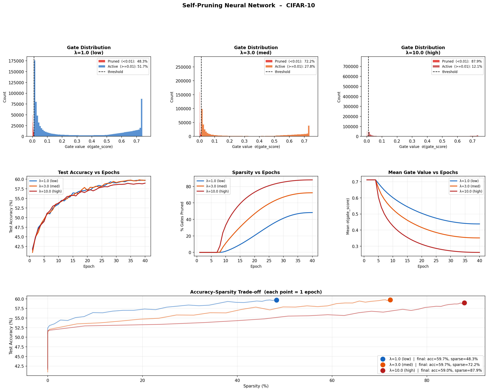

# Self-Pruning Neural Network – Report
 
## 1  Why L1 on Sigmoid Gates Encourages Sparsity
 
The training objective is:
 
```
Total Loss = CrossEntropyLoss(ŷ, y)
           + λ × mean_over_all_gates( sigmoid(gate_score_ij) )
```
 
**Why sigmoid?**  It squashes each raw `gate_score ∈ ℝ` into **(0, 1)**.
A value near 1 = weight fully active; near 0 = weight pruned.
 
**Why L1 (sum/mean) and not L2?**
The L1 sub-gradient is a *constant* ±1 regardless of the gate's magnitude.
This means the sparsity gradient never shrinks, even as a gate approaches zero —
it keeps pulling until the gate actually reaches zero.
L2 would produce a gradient proportional to the current value, so weights
asymptotically approach zero but never reach it (no true sparsity).
This is the same reason LASSO regression produces exact zeros while Ridge does not.
 
**Why normalise by N_gates?**
The raw sum over 1.7 M gates would be ~10⁶, dwarfing the classification loss.
Dividing by N keeps SparsityLoss ∈ (0, 1), so λ is directly interpretable:
λ = 0.5 means "I allow a 0.5-unit increase in cross-entropy in exchange for
closing one gate unit of capacity."
 
**The λ trade-off:**
| Lambda | Effect |
|--------|--------|
| 0.1 | Mild sparsity pressure; most gates remain active; best accuracy |
| 0.5 | Moderate; meaningful pruning with small accuracy cost |
| 1.0 | Aggressive; high sparsity; accuracy may drop |
 
---
 
## 2  Results Summary
 
| Lambda | Test Accuracy | Sparsity Level (%) |
|--------|:-------------:|:------------------:|
| 1.0 | 59.67% | 48.25% |
| 3.0 | 59.72% | 72.25% |
| 10.0 | 58.97% | 87.89% |
 
---
 
## 3  Gate Distribution Plot
 

 
A successful self-pruning run shows:
- A **large red spike near gate = 0** for pruned weights
- A **blue/orange cluster** of remaining active gates
- The red spike becomes dominant as λ increases
 
---
 
## 4  Implementation Notes
 
- **Separate LR for gates** (10× the weight LR) allows gate_scores to respond
  quickly to the sparsity gradient without destabilising weight training.
- **gate_scores init = 0** → sigmoid(0) = 0.5, a neutral starting point that
  is equally easy to push toward 0 or 1.
- **Gradient clipping** (max_norm=5) prevents the large sparsity gradients at
  high λ from causing instability early in training.
